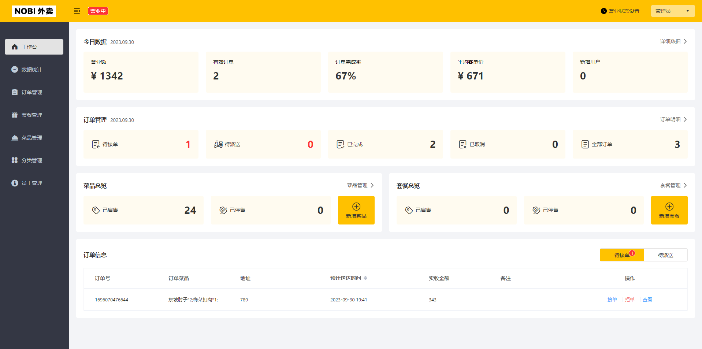
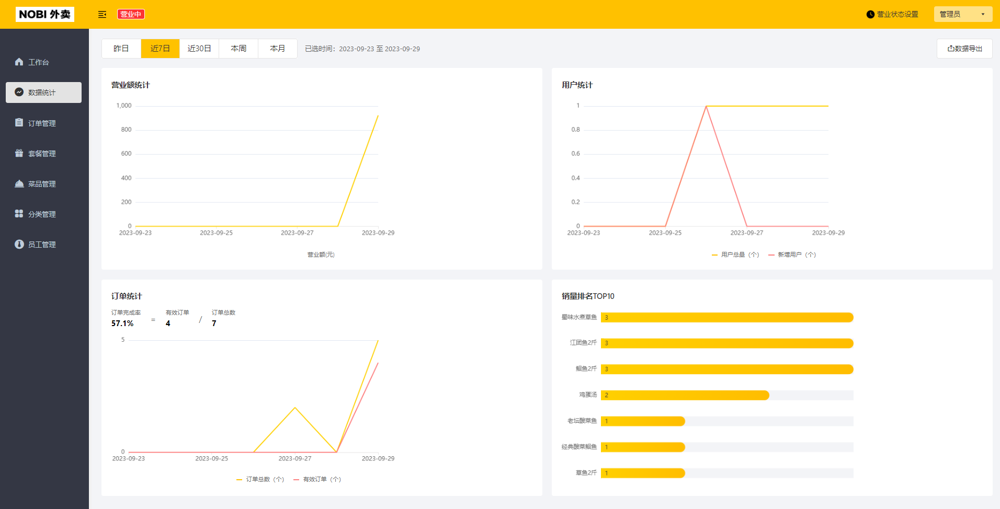
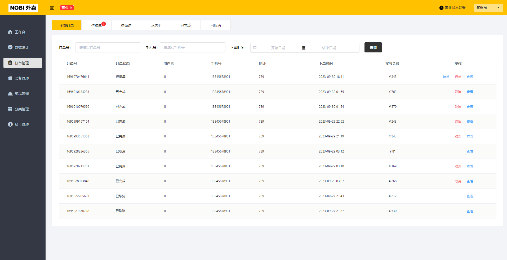
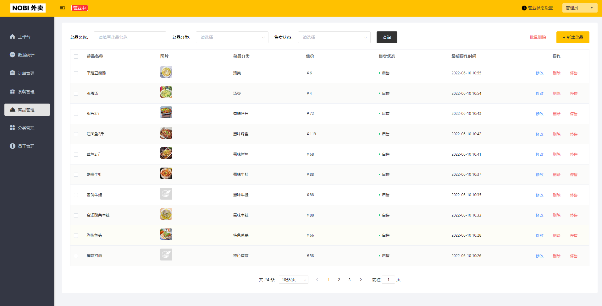
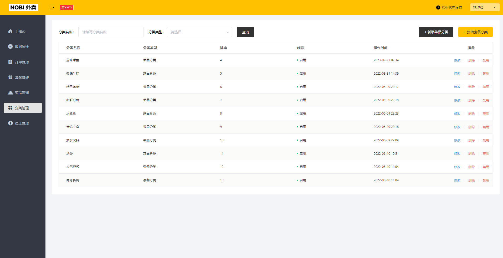
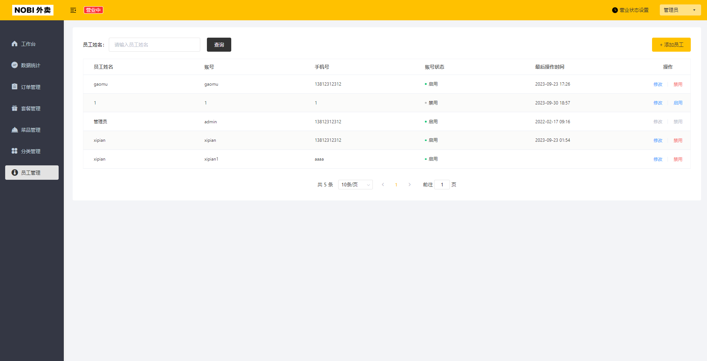
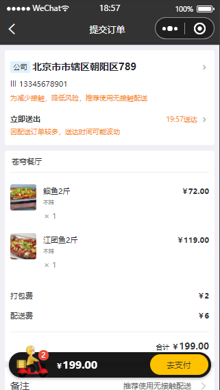
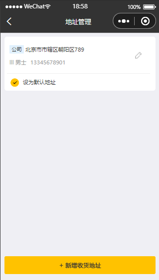
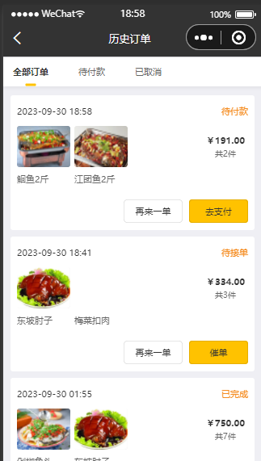

# NOBI外卖项目
## 1.项目介绍
本项目为前后端分离的外卖项目的后端，前端采用的是苍穹外卖提供的页面，其中：

**1). 管理端**

餐饮企业内部员工使用。 主要功能有:

| 模块      | 描述                                             |
| --------- |------------------------------------------------|
| 登录/退出 | 内部员工必须登录后,才可以访问系统管理后台                          |
| 员工管理  | 管理员可以在系统后台对员工信息进行管理，包含查询、新增、编辑、禁用等功能           |
| 分类管理  | 主要对当前餐厅经营的 菜品分类 或 套餐分类 进行管理维护， 包含查询、新增、修改、删除等功能 |
| 菜品管理  | 主要维护各个分类下的菜品信息，包含查询、新增、修改、删除、启售、停售等功能          |
| 套餐管理  | 主要维护当前餐厅中的套餐信息，包含查询、新增、修改、删除、启售、停售等功能          |
| 订单管理  | 主要维护用户在移动端下的订单信息，包含查询、取消、派送、完成等功能      |
| 数据统计  | 主要完成对餐厅的各类数据统计，如营业额、用户数量、订单等，还可以导出单报表             |
**2). 用户端**

移动端应用主要提供给消费者使用。主要功能有:

| 模块        | 描述                                                         |
| ----------- | ------------------------------------------------------------ |
| 登录/退出   | 用户需要通过微信授权后登录使用小程序进行点餐                 |
| 点餐-菜单   | 在点餐界面需要展示出菜品分类/套餐分类, 并根据当前选择的分类加载其中的菜品信息, 供用户查询选择 |
| 点餐-购物车 | 用户选中的菜品就会加入用户的购物车, 主要包含 查询购物车、加入购物车、删除购物车、清空购物车等功能 |
| 订单支付    | 用户选完菜品/套餐后, 可以对购物车菜品进行结算支付, 这时就需要进行订单的支付 |
| 个人信息    | 在个人中心页面中会展示当前用户的基本信息, 用户可以管理收货地址, 也可以查询历史订单数据 |
**由于个人开发者无法调用微信支付的接口，所以对支付功能进行了简化，只修改了数据库，若需真正实现，可使用 [WxJava](https://github.com/Wechat-Group/WxJava) 库**

## 2.后端各个模块介绍

| **名称**        | **说明**                                                     |
|---------------| ------------------------------------------------------------ |
| nobi-take-out | maven父工程，统一管理依赖版本，聚合其他子模块                |
| nobi-common   | 子模块，存放公共类，例如：工具类、常量类、异常类等           |
| nobi-pojo     | 子模块，存放实体类、VO、DTO等                                |
| nobi-server   | 子模块，后端服务，存放配置文件、Controller、Service、Mapper等 |

## 3.后端项目技术选型
- SpringBoot： 快速构建 Spring 项目, 采用 "约定优于配置" 的思想, 简化 Spring 项目的配置开发
- Spring Task：实现定时处理过期的订单和长时间处于未完成状态的订单
- httpclient： 对 http 请求的发送，后端请求微信服务接口，实现微信登录功能
- Redis：用于缓存店铺营业状态和缓存菜品数据，减少数据库查询操作
- Spring Cache：使用 Redis 的缓存实现，实现缓存套餐数据，减少数据库查询操作
- JWT:  用于用户进行身份验证的标记
- Swagger： 自动生成接口文档，并对接口进行测试
- POI: 对Excel表格进行操作，实现导出数据报表
- WebSocket: 实现项目的来单、催单功能实现
- 阿里云OSS:  对象存储服务，实现菜品等图像的上传存储
- MySQL：存储项目的所有表，所需的sql文件已放在根目录下
- Mybatis：将SQL语句和Java代码分离，减低耦合
- pagehelper:  分页插件，实现分页查询
- git: 版本控制工具, 使用该工具对项目中的代码进行管理
- maven: 避免依赖冲突

## 4.项目运行展示
### 管理后台：

### 用户小程序：

